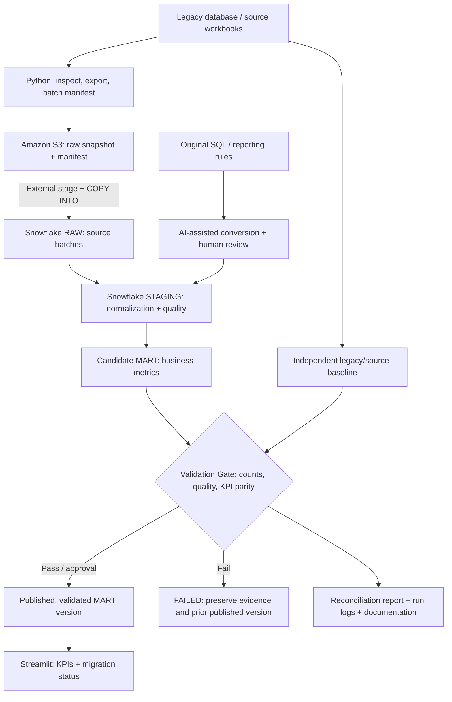

# Datathon Use Case 4 | AI-Assisted Legacy System Migration

[English](README.md) · [简体中文](README_CN.md)

> **Status:** Proposed team architecture and delivery plan; listed features have not yet been implemented.  
> **Target:** Migrate legacy health-supplies sales data and reporting to **Snowflake on AWS**, demonstrate AI-assisted SQL conversion, and independently validate business results.  
> **MVP stack:** Python + SQL + Amazon S3 + Snowflake + Streamlit. **Spring Boot, Java, a separate REST API and a JavaScript frontend are not prerequisites.**

## 1. Purpose and scope

The main outcome is a **verifiable migration**, not merely a dashboard containing numbers. The team must cover five outcomes:

| Outcome | Minimum supporting evidence |
|---|---|
| Analyse legacy assets | Source inventory, field definitions, existing SQL/report logic and KPI rules |
| Design the target architecture | Data-flow diagram, component ownership, access boundaries and handoffs |
| Demonstrate AI-assisted conversion | Original SQL/report logic, generated Snowflake SQL, human modifications and review record |
| Validate and test | Source-to-RAW counts, legacy-versus-target KPI comparison, data-quality and failure records |
| Document the migration | Source-to-target mapping, rerun instructions, validation results and known limitations |

**MVP use case:** Produce a monthly-sales-by-region report from one confirmed source dataset. The Data Analyst must first define reporting date, currency, handling of returns, aggregation grain and an independent legacy/source baseline. Existing Excel files in this repository are **candidate sources**: inspect actual sheets, columns and semantics and verify whether usable legacy SQL exists before claiming a migration has occurred.

**Scope boundary:** Snowflake remains the target data warehouse; S3 stores raw objects rather than executing SQL. Python handles extraction, batch control, verification and the dashboard connection. Heavy joins, cleaning and aggregation should run in Snowflake SQL. Consider FastAPI later only if a standalone API or multiple clients are actually needed.

## 2. Target architecture



| Component | Responsibility | Boundary |
|---|---|---|
| Legacy source | Original data, report logic and independent baseline | Do not change the baseline simply to force agreement |
| Python | Inspect/export data, batch manifest, orchestration and validation | Do not turn Streamlit into a bulk ETL engine |
| Amazon S3 | Preserve source snapshots and manifests | Object storage, not the SQL engine |
| Snowflake RAW | Imported records and source/batch identifiers | Do not silently discard invalid records |
| Snowflake STAGING | Type conversion, mapping and documented cleaning | Record changed or rejected records and their rules |
| Candidate MART | Calculate metrics before release | Must not overwrite the version currently shown to users |
| Validation Gate | Check completeness, quality and KPI parity | Unexplained critical differences block publication |
| Streamlit | Read published MART and report validation status | Server-side secrets only; never commit credentials |

**Deployment:** For the MVP, Python scripts and Streamlit may run on a team development machine while S3 and Snowflake run in the cloud. Do not require every component to be hosted on AWS unless the event rules mandate it.

## 3. Trustworthy and resilient data pipeline

A **trustworthy pipeline** preserves provenance, uses reviewable transformations, reconciles independently against source business results, and never treats unvalidated output as released data. **Resilience** means failures are observable and contained, retry is safe, and previously validated output stays available.

### 3.1 Batches, run states and lineage

Give every execution a unique `run_id`; identify source content with a stable file identifier or hash and record its S3 key, extraction time, expected row count and `batch_id`. Use explicit states:

```text
PENDING → INGESTING → TRANSFORMING → VALIDATING → PUBLISHED
               ↘ FAILED ←───────────────────↙
```

A run may fail at any step. Keep at least `run_id`, source object, start/end times, status, loaded row count, error reason and validation outcome. Mark `PUBLISHED` **only after checks and approval actually succeed**. A retry receives a new run record and retains evidence of the prior failure.

Example S3 key layout (proposal only; no real bucket is implied):

```text
s3://<project-bucket>/raw/<batch_id>/sales.csv
s3://<project-bucket>/raw/<batch_id>/manifest.json
s3://<project-bucket>/rejected/<batch_id>/invalid_records.csv
```

Keep original files instead of overwriting old snapshots. Enable S3 versioning where appropriate. The manifest records origin, expected row count and a content hash such as SHA-256 to support traceability and duplicate-batch detection.

### 3.2 Idempotency and safe recovery

- **Minimum:** Check source/batch identifiers before loading; inspect RAW state before retry; do not blindly append a previously loaded batch to the published MART.
- **Standard:** Make reruns non-duplicating with a manifest and a defined deduplicate/replace strategy; bound retries and use backoff for transient network or connection errors.
- **Advanced:** Add stage-level recovery, a published-version pointer, rollback and run monitoring.

Snowflake `COPY INTO` load history can help avoid reloading files, but **does not establish end-to-end idempotency**: changed files, forced loads, source-level duplicate business events and repeated downstream aggregations all require separate treatment. Invalid CSV, logically incorrect SQL and unmatched KPIs are not fixed by blind retry.

### 3.3 Validation Gate

1. Load and transform data into an **isolated candidate MART** rather than modifying the published result in place.
2. Check source/RAW counts, required fields, month-by-region KPI values and agreed quality rules against an independently captured baseline.
3. Publish only when critical checks pass and the responsible person approves. A manual release is sufficient for the MVP; automation belongs in Standard.
4. If validation fails, retain candidate data and error evidence while preserving the **last successfully published version**. If none exists, show "No validated data available."
5. Streamlit must label the published batch and data-refresh time, and may show the latest failed run without presenting it as current verified data.

A pipeline that writes into the live MART *before* running its checks does not implement a meaningful release gate. Candidate and published data need separate query entry points. A candidate table and a controlled versioned view or publication record are sufficient initial choices; release must avoid exposing a partially updated result.

## 4. AI-assisted migration: generate, review, reconcile

1. Preserve the unmodified legacy SQL/report definition, source schema, business rules and independent baseline.
2. Ask AI to draft Snowflake-compatible SQL and source-to-target mappings.
3. Review join keys, NULL handling, dates, currencies, return rules, aggregation grain, permissions and destructive SQL risks.
4. Execute approved statements only in DEV or against controlled candidate data.
5. Reconcile legacy and target outputs using the same definitions; record the prompt/model version, output, human edits, test evidence and reviewer.

**Do not allow AI to generate both the migration logic and the only supposed ground truth, then call matching outputs a success.** Use results from the source system or an independently computed, human-approved business baseline.

## 5. Delivery levels and team roles

**Minimum Delivery** is the mandatory MVP contribution for each role. **Standard Delivery** adds dependable reruns, automation and deeper reconciliation. **Advanced Delivery** builds on both with recoverability, observability and reuse. These levels guide task allocation according to experience; Advanced is optional. The six roles describe responsibility areas, not necessarily six distinct people.

Each role has **separate English and Chinese README files** under [`doc/`](doc/), including tasks, concrete artifacts and acceptance tests:

| Role | Minimum Delivery | Standard Delivery | Advanced Delivery |
|---|---|---|---|
| [Solution Architect](doc/Solution_Architect/README.md) | Scope, Python/SQL architecture, data flow, owners, validation gate and acceptance | Run-state/release design, contracts and integration tests | Versioned publication, rollback drills and reusable playbook |
| [Cloud Engineer](doc/Cloud_Engineer/README.md) | S3, Snowflake DEV, least-privilege access and external stage | Environment separation, access audit, cost controls, repeatable setup | Infrastructure as code, monitoring/alerts and recovery exercises |
| [Data Engineer](doc/Data_Engineer/README.md) | Python source inspection/export, S3 upload, RAW ingestion and count check | `batch_id`, load logs, non-duplicating reruns, bounded retry and rejected-record handling | Incremental ingestion, stage-level recovery and automated scheduling |
| [Analytics Engineer](doc/Analytics_Engineer/README.md) | Human-reviewed AI SQL conversion and STAGING/candidate MART | Transformation tests, mappings and grouped-reconciliation support | Lineage, reusable models and controlled AI-generated test drafts |
| [Data Analyst](doc/Data_analyst/README.md) | KPI definition, independent baseline, dashboard requirements and named Streamlit owner | Filters, grouped comparison, freshness and validation-state UX | Migration-readiness and decision-support visualisations |
| [Data Scientist](doc/Data_Scientist/README.md) | Quality report, source/target counts and one KPI comparison | Automated tests, month-by-region reconciliation and anomaly analysis | Drift detection, scoped AI SQL evaluation and optional ML demo |

**Explicit implementation owner required:** The Team Lead must name the person who actually builds the Streamlit app. That person may be the Data Analyst or another Python-capable member; defining a dashboard is not the same as coding it. All roles deliver actual code, documentation or verifiable evidence rather than plans alone.

### Role handoffs

```text
Cloud Engineer → Data Engineer: S3 key, external stage, access permissions
Data Engineer → Analytics Engineer: RAW table, schema, source and batch metadata
Data Analyst → Analytics Engineer / Data Scientist: KPI definition and independent baseline
Analytics Engineer → Data Scientist: candidate MART, SQL and conversion log
Data Scientist → Solution Architect: validation report, exceptions and release evidence
Solution Architect → Streamlit owner: approved/published MART query and display contract
```

## 6. End-to-end MVP acceptance

- [ ] Confirm one usable source dataset, available legacy SQL/report logic and the monthly-sales KPI definition.
- [ ] Review the architecture, name component owners and agree on handoffs.
- [ ] Export CSV/Parquet, preserve in S3 and load the data into Snowflake RAW.
- [ ] Capture source file, batch manifest, loaded row count and relevant failure records.
- [ ] AI-convert at least one real legacy SQL query/report transformation, preserving the original, output and human review. If no legacy SQL exists, disclose this and demonstrate AI conversion of the documented original report logic without inventing an original query.
- [ ] Build STAGING and a candidate MART that calculates the selected KPI.
- [ ] Compare source/RAW counts and monthly/regional KPI values with the independent baseline; resolve or document all critical differences.
- [ ] Make only validated output available for Streamlit; a failed candidate must not replace published data.
- [ ] Show at least one KPI, a month/region filter, the published batch and data-refresh time.
- [ ] Publish rerun instructions, validation evidence, limitations and the end-to-end demo steps.

**Acceptance principle:** "SQL runs" or "the dashboard has numbers" is not proof of a successful migration. Original source evidence, AI conversion/review, independent reconciliation and a verified published result are the minimum.

## 7. Proposed repository structure

The following directories are **planned**, not claims that the corresponding implementation already exists. Preserve existing candidate Excel workbooks and do not assume their column names.

```text
datathon/
├── README.md                       # English overview
├── README_CN.md                    # Chinese overview
├── doc/
│   ├── Solution_Architect/{README.md,README_CN.md}
│   ├── Cloud_Engineer/{README.md,README_CN.md}
│   ├── Data_Engineer/{README.md,README_CN.md}
│   ├── Analytics_Engineer/{README.md,README_CN.md}
│   ├── Data_analyst/{README.md,README_CN.md}
│   └── Data_Scientist/{README.md,README_CN.md}
├── data/                           # Set Git tracking rules; exclude sensitive data
├── src/
│   ├── extract.py                  # Source export
│   ├── ingest.py                   # S3 → Snowflake RAW
│   ├── pipeline.py                 # State and batch coordination
│   └── validate.py                 # Data quality and KPI reconciliation
├── sql/
│   ├── legacy/
│   ├── staging/
│   ├── mart/
│   └── tests/
├── dashboard/app.py                # Streamlit
├── docs/
│   ├── architecture.md
│   ├── data-dictionary.md
│   ├── source-to-target.md
│   ├── ai-conversion-log.md
│   └── validation-report.md
└── infra/                          # Cloud configuration docs; no secrets
```

## 8. Security, costs and open questions

- Apply least-privilege AWS IAM and Snowflake roles. Streamlit should access published MART with a read-only identity; keep credentials in a secure server-side configuration or secret manager, never in the repository.
- Prefer synthetic or de-identified demo data; establish permissions and applicable privacy obligations before using real personal or health information.
- Set AWS budget alerts, choose a small Snowflake warehouse with auto-suspend, and avoid unnecessary always-on services.
- **Still to verify:** actual source schema, availability of legacy SQL, team size, event deadline, cloud budget and deployment requirements. If executable legacy SQL does not exist, disclose that limitation and use a human-confirmed original report transformation as the AI migration example; do not fabricate a legacy query.

**Implementation status:** This document is a proposed design. Update task status only after the corresponding implementation and test evidence exist. Detailed role-level acceptance requirements are in the linked `doc/` READMEs.
