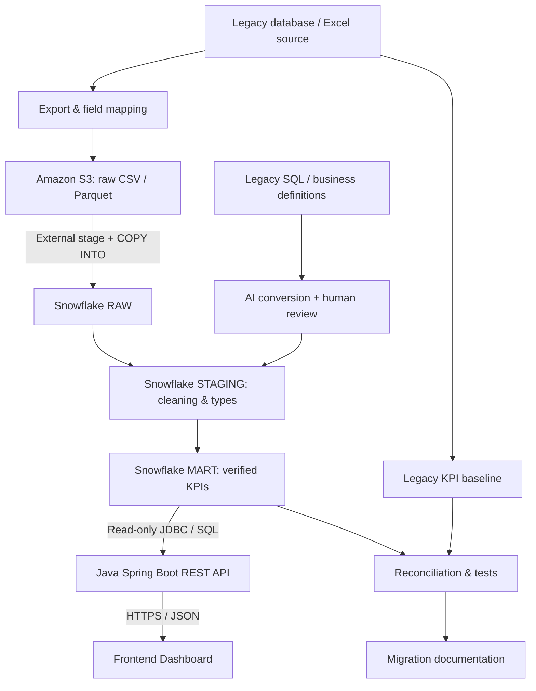

# Datathon — AI-Assisted Legacy System Migration

[English](README.md) | [简体中文](README_CN.md)

> Use Case 4 · Solution architecture and team delivery plan  
> **Status:** Proposed design, not a claim of completed deployment.  
> **Target:** Snowflake on AWS. 

## 1. Project overview

Migrate legacy health-supplies sales reporting to a cloud analytics platform. Use AI to assist with inventorying legacy assets, mapping fields, converting SQL, and drafting tests and documentation. The migrated reporting results must be reconciled against a legacy baseline; a functioning dashboard alone does not demonstrate a correct migration.

| Expected outcome | Evidence |
|---|---|
| Analyse legacy assets | Source-file/table inventory, legacy SQL, report and KPI definitions |
| Design target architecture | Architecture diagram, data flow, responsibilities and permissions |
| Demonstrate AI assistance | Original SQL, AI-generated conversion, human edits and approval log |
| Validate and test | Row counts, KPI reconciliation and quality checks |
| Document migration | Data dictionary, source-to-target mapping, runbook and known limitations |

**MVP:** Produce *monthly sales by region* from one agreed source dataset. Confirm the reporting date, currency, sales/returns rules and region definition before implementing SQL. The existing Excel workbooks are candidate source files; inspect their sheets and fields before assuming they represent a legacy database export.

## 2. Target architecture



| Layer | Responsibility | Boundary |
|---|---|---|
| Legacy source | Original sales data, reports, definitions and baseline | Preserve legacy business rules for comparison |
| Amazon S3 | Store immutable raw exports and load manifests | Object storage, **not** the SQL engine |
| Snowflake on AWS | Ingest, transform, validate and query data | Use **RAW → STAGING → MART**; perform bulk ETL in SQL |
| Spring Boot | Validate requests, enforce access and expose approved queries as JSON APIs | Read-only access to MART; do not load all S3 files into Java for dashboard requests |
| Dashboard | Show sales KPIs and migration validation | Access data through the API; no database credentials in the browser |

Start with a reproducible batch: export source data to CSV/Parquet, upload to S3, configure a least-privilege Snowflake storage integration and external stage, then use `COPY INTO` to load RAW. Snowpipe, Streams/Tasks and dbt are optional follow-on tools.

### Proposed repository layout

The folders below are **planned**, not already implemented. Preserve the existing workbooks as source candidates.

```text
datathon/
├── README.md
├── README_CN.md
├── 2026-*.xlsx                # Existing source candidates
├── docs/
│   ├── architecture.md
│   ├── data-dictionary.md
│   ├── source-to-target.md
│   ├── ai-conversion-log.md
│   └── validation-report.md
├── sql/{legacy,raw,staging,mart,tests}/
├── backend/                   # Spring Boot
├── frontend/                  # Dashboard
└── infra/                     # Never store secrets
```

## 3. API and dashboard contract

Proposed endpoint: `GET /api/v1/sales/monthly?month=YYYY-MM&region=REGION`. Spring Boot queries an approved MART view with parameterised SQL and returns the month, region, currency, sales total and data-refresh timestamp as JSON. Agree on the exact response schema and KPI definition before splitting frontend and backend work. Validate inputs, use query timeouts and configure appropriate access controls.

The MVP dashboard needs a monthly sales KPI, month/region filters, one trend or region-comparison chart and a reconciliation status or link to validation evidence. Keep the UI minimal until the migration itself is demonstrably correct.

## 4. Team responsibilities and delivery phases

Roles indicate **responsibilities**, not necessarily six separate people. Assign actual team members based on availability.

### Phase 1 — Basic: working end-to-end MVP

| Role | Tasks | Deliverable |
|---|---|---|
| **Solution Architect** | Define scope, architecture, KPI semantics, API contract, dependencies and acceptance criteria. | Architecture v1, scope and interface contract |
| **Cloud Engineer** | Configure S3, minimum IAM permissions, Snowflake DEV, storage integration and external stage. | Working development environment |
| **Data Engineer** | Inspect sources, export CSV/Parquet, upload to S3 and load one RAW table with `COPY INTO`. | Repeatable initial load and load counts |
| **Analytics Engineer** | Inventory legacy SQL; use AI to convert one representative query; review it and implement STAGING/MART SQL. | Original and converted SQL, review notes, first model |
| **Data Analyst** | Define sales, returns, reporting period and region; compute the legacy baseline and sketch a dashboard. | KPI dictionary, baseline and mock-up |
| **Data Scientist** | Profile missing values, duplicate keys, bad dates/amounts and compare initial source/target results. | Quality report and first reconciliation |

**Exit criteria:** One dataset can be reloaded into RAW; one AI-assisted SQL conversion is human-reviewed; source/target row counts and agreed KPIs agree or discrepancies are explained; the API and dashboard show the verified result.

### Phase 2 — Standard: reliable, documented migration

| Role | Tasks | Deliverable |
|---|---|---|
| **Solution Architect** | Finalise RAW/STAGING/MART, permissions, interfaces, review gates and risks. | Architecture v2 and risk register |
| **Cloud Engineer** | Separate DEV/PROD where practical; add cost controls, repeatable setup and optional scheduled ingestion. | Controlled cloud environment |
| **Data Engineer** | Make loads idempotent, log batches, handle schema changes and optional incremental imports. | Rerunnable ingestion pipeline |
| **Analytics Engineer** | Add tested SQL models; convert more legacy queries with AI, logging prompts, outputs, human edits and results. Optionally use dbt. | Models, tests and conversion log |
| **Data Analyst** | Compare legacy/new reporting filters, aggregations and KPI rules; refine the dashboard. | Side-by-side report comparison |
| **Data Scientist** | Reconcile by month × region × product category; explain discrepancies and measure first-pass AI conversion correctness. | Detailed reconciliation and AI evaluation |

**Exit criteria:** Reruns do not duplicate records, critical tests pass, totals and grouped KPIs reconcile, and mappings and AI review decisions are traceable.

### Phase 3 — Advanced: optional differentiators

| Role | Tasks | Deliverable |
|---|---|---|
| **Solution Architect** | Create a reusable migration playbook, rollback plan and effort estimate. | Playbook and risk/effort summary |
| **Cloud Engineer** | Add Terraform, CI/CD, monitoring and cost alerts if justified. | Reproducible infrastructure |
| **Data Engineer** | Prototype an assistant that proposes SQL, runs only approved DEV checks and flags mismatches. | Human-approved migration prototype |
| **Analytics Engineer** | Use AI for documentation/test drafts and present data lineage. | Documentation and lineage |
| **Data Analyst** | Add migration-readiness checks and unresolved exceptions to the dashboard. | Migration-quality view |
| **Data Scientist** | If supported by the data, demonstrate forecasting or near-expiry inventory alerts. | Optional ML demo |

**Priority:** Complete Phase 1, then prioritise AI conversion evidence and reconciliation from Phase 2. Phase 3 is optional.

## 5. AI-assisted conversion process

1. **Capture:** Keep original SQL, schema, sample inputs, baseline output and business definitions.
2. **Generate:** Request Snowflake-compatible SQL and explicit source-to-target mappings from AI.
3. **Review:** A human checks joins, types, nulls, dates, currency, returns and aggregation grain.
4. **Test in DEV:** Execute approved SQL against controlled data; do not grant an AI agent production write access.
5. **Reconcile:** Compare results against the legacy baseline and investigate differences.
6. **Record:** Preserve prompts/model version, generated SQL, human edits, tests, reviewer and approval.

**Successful SQL execution is not proof of business equivalence.** Both syntax and output must be validated.

## 6. Validation and acceptance

| Check | Method | Acceptance |
|---|---|---|
| Row counts | Compare source exports, RAW and documented filtering stages. | Exact match unless intentionally filtered; explain every delta. |
| Business KPIs | Compare sales and returns with identical definitions and currency precision. | No unexplained monetary difference. |
| Grouped reconciliation | Compare month × region, plus category where available. | No unexplained grouped mismatch; grand totals alone are insufficient. |
| Data quality | Test required fields, uniqueness, valid types/dates/amounts and referential integrity. | Agreed critical checks pass; exceptions recorded. |
| API consistency | Compare API output with the approved MART query using the same filters. | Values agree. |

Retain source snapshots, mappings, SQL versions and test evidence. Never silently drop bad records solely to force matching totals.

## 7. Security, governance and cost

- Use least-privilege IAM and Snowflake roles. The API should read approved MART data only.
- Never commit AWS credentials, Snowflake secrets, private keys, `.env` files or patient/customer data.
- Prefer synthetic or de-identified demo data. Confirm event data-use rules and applicable privacy obligations before processing personal or health information.
- Set AWS cost alerts, right-size Snowflake warehouses and use auto-suspend. Avoid unnecessary always-on services.
- Local API/frontend deployment is acceptable for an MVP unless the organisers require cloud hosting.

## 8. Implementation order and current status

| Step | Team action | Evidence |
|---|---|---|
| 1 | Inspect source sheets, fields, legacy queries and KPI rules. | Data dictionary and legacy baseline |
| 2 | Confirm ownership, architecture and API response schema. | Approved diagram and interface contract |
| 3 | Upload a source export to S3 and load Snowflake RAW. | Load log and row counts |
| 4 | Convert and review one legacy query; build STAGING/MART. | SQL and AI conversion log |
| 5 | Reconcile sales by month and region. | Validation report |
| 6 | Connect Spring Boot's read-only endpoint to a minimal dashboard. | End-to-end demonstration |
| 7 | Package evidence, known limitations and a migration runbook. | Reproducible handover |

**Implementation status:** The existing repository contains candidate Excel files and planning documentation. The following are not yet verified as complete:


- [ ] Load one dataset from S3 into Snowflake RAW.
- [ ] Review an AI-converted SQL query and its mappings.
- [ ] Reconcile source and target KPIs.
- [ ] Implement and demonstrate the Spring Boot API and dashboard.
- [ ] Publish migration evidence and documentation.
