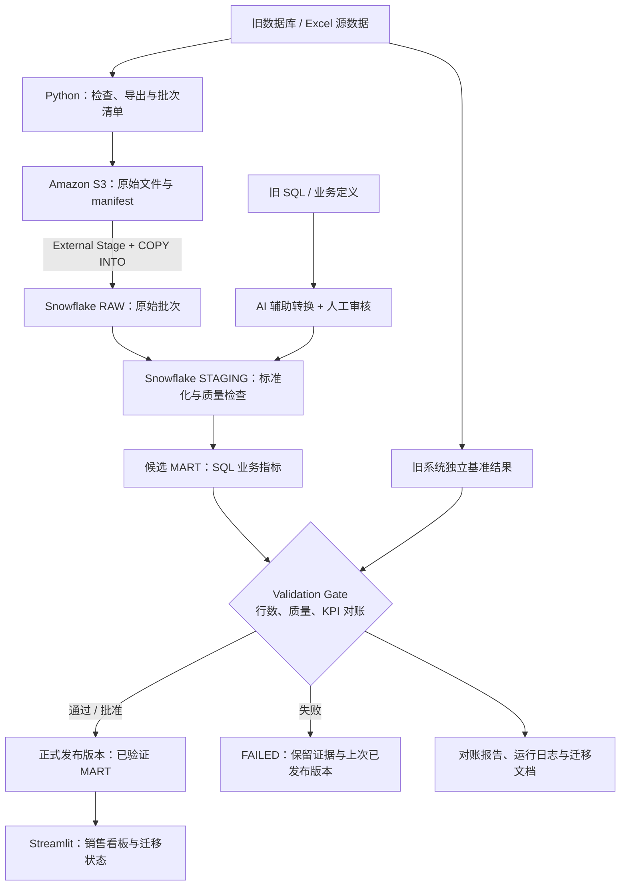

# Datathon Use Case 4｜AI 辅助传统系统迁移

[简体中文](README_CN.md) · [English](README.md)

> **项目状态：** 本文是团队拟采用的架构与交付计划，不代表各项功能已完成。  
> **目标：** 将旧系统的医疗用品销售数据和报表迁移到 **Snowflake on AWS**；展示 AI 辅助 SQL 转换，并使用独立基准与自动／人工检查验证迁移结果。  
> **MVP 技术栈：** Python + SQL + Amazon S3 + Snowflake + Streamlit。**Spring Boot、独立 REST API、Java 和前端 JavaScript 均非必需。**

## 1. 项目目标与范围

本项目的重点是**可验证的系统迁移**，不是仅搭建一个展示数据的 Dashboard。团队需覆盖以下五项成果：

| 目标 | MVP 交付证据 |
|---|---|
| 分析旧系统资产 | 源数据清单、字段定义、旧 SQL／报表逻辑及业务 KPI 口径 |
| 设计目标架构 | 数据流图、组件职责、访问权限及角色交接说明 |
| 展示 AI 辅助迁移 | 原始 SQL／报表逻辑、AI 生成的 Snowflake SQL、人工修改与审核记录 |
| 验证与测试 | 导入行数检查、业务 KPI 新旧对账、数据质量报告及失败记录 |
| 迁移文档 | 源到目标字段映射、重跑步骤、验证结果和已知限制 |

**MVP 用例：** 从一份确认过的原始数据生成“按月份、地区汇总的销售额”报表。实施前，Data Analyst 应明确业务日期、币种、退货处理、汇总粒度，以及旧系统的基准结果。仓库中现有的 Excel 文件只作为**候选数据源**；具体工作表、列名、字段语义及是否存在真实旧 SQL，需要先检查，不预先假定。

**范围界限：** Snowflake 仍是迁移目标；S3 保存对象而非执行 SQL。Python 负责数据提取、批次控制、验证和界面连接；大批量清洗、关联和聚合优先在 Snowflake SQL 中完成。只有在确实需要多个客户端或独立服务时，才额外引入 FastAPI；不为技术展示而增加 Spring Boot。

## 2. 目标架构



| 组件 | 职责 | 明确边界 |
|---|---|---|
| 旧系统／Excel | 提供原始数据、旧查询及独立基准 | 不为了让结果一致而改写旧系统基准 |
| Python | 数据检查与导出、批次清单、管道执行及验证 | 不将全部数据处理和聚合塞入 Streamlit |
| Amazon S3 | 保存源文件快照与批次 manifest | 对象存储；不负责 SQL 查询 |
| Snowflake RAW | 记录源数据及批次信息 | 保留可追溯来源，不静默丢弃异常行 |
| Snowflake STAGING | 类型转换、清洗、映射与数据质量检查 | 记录处理规则及被过滤／拒绝的记录 |
| Snowflake 候选 MART | 计算待验证的业务 KPI | 不直接覆盖 Dashboard 正在使用的已发布结果 |
| Validation Gate | 比较数据完整性、业务 KPI、关键质量规则 | 未通过或未解释的关键差异不得发布 |
| Streamlit | 只读查询已发布数据，显示 KPI 与验证状态 | 凭证仅保存在服务端安全配置中，不写入仓库 |

**简化部署：** MVP 的 Python 脚本和 Streamlit 可以先在团队开发机运行；S3 和 Snowflake 使用云服务。不要求所有组件都部署到 AWS，除非比赛规则另有规定。

## 3. 可信数据管道与故障恢复

本项目的 **Trustworthy Pipeline（可信数据管道）** 指原始数据可追溯、转换逻辑可审核、结果能与独立基准对账，且未通过验证的结果不会被当作正式数据使用。**Resilience（韧性）** 指故障可观察、可控制，修复后能安全重试，并保留上次验证通过的结果。

### 3.1 批次、状态和来源追溯

每次执行分配唯一 `run_id`；每份源文件记录稳定的 `source_file_id` 或文件哈希、S3 对象路径、导出时间、源行数及所属批次。建议状态如下：

```text
PENDING → INGESTING → TRANSFORMING → VALIDATING → PUBLISHED
                 ↘ FAILED ←───────────────↙
```

失败可发生在任意处理阶段。批次日志至少记录 `run_id`、源文件、开始／结束时间、当前状态、导入行数、失败原因和验证结果。**只有实际验证完成后才能标记为 PUBLISHED。** 失败重跑时创建新的运行记录，并保留原始失败证据。

S3 示例路径（仅为方案，未创建实际 Bucket）：

```text
s3://<project-bucket>/raw/<batch_id>/sales.csv
s3://<project-bucket>/raw/<batch_id>/manifest.json
s3://<project-bucket>/rejected/<batch_id>/invalid_records.csv
```

不要覆盖历史原始文件；必要时启用 S3 Versioning。`manifest.json` 应包含源文件标识、预期行数及内容哈希（例如 SHA-256），用于重复导入判断与追溯。

### 3.2 幂等性与安全重试

- **Minimum：** 按文件与批次标识检查是否已成功导入；重跑前检查 RAW 现状，不直接向正式 MART 再次追加同一批数据。
- **Standard：** 使用批次清单和明确的去重／替换策略，使同一批次重跑不会重复计数；重试网络或临时连接错误时设置次数上限和退避时间。
- **Advanced：** 实现阶段级恢复、发布版本指针、可回滚的发布流程和运行监控。

`COPY INTO` 的加载历史可以辅助避免重复加载，但**不能单独保证整个管道幂等**：文件内容变更、强制重新加载、源数据业务重复与下游重复聚合仍需单独处理。CSV 格式错误、SQL 逻辑错误和新旧 KPI 差异不应通过盲目自动重试掩盖。

### 3.3 Validation Gate（验证关卡）

1. Python／SQL 完成数据导入及转换，在**独立候选 MART** 中生成待发布指标。
2. 使用独立保存的旧系统基准，检查源／RAW 行数、关键字段、月份 × 地区 KPI 及约定的数据质量规则。
3. 关键检查全部通过后，才能将该批次标记为可发布。MVP 可以由负责人进行人工批准；Standard 再增加自动化发布条件。
4. 验证失败时保留候选数据、错误记录和**上一次已发布版本**，不让 Dashboard 误读失败批次；若尚无成功版本，则显示“暂无已验证数据”。
5. Streamlit 展示已发布版本、数据更新时间以及最近一次迁移的验证状态，避免把旧数据误展示为最新数据。

**注意：** 简单先写正式 MART 再运行检查，不构成有效的发布关卡。候选数据与正式查询入口必须隔离。实际实现时可采用独立候选表，加受控的发布视图／版本记录；发布操作本身需要避免读到一半更新的数据。

## 4. AI 辅助迁移：生成、审核与对账

1. 保存未经修改的旧 SQL／报表定义、源表 Schema、业务口径和独立基准。
2. 使用 AI 生成 Snowflake SQL 和源字段到目标字段映射草稿。
3. 人工检查连接键、NULL、日期、币种、退货逻辑、聚合粒度、访问权限与 SQL 是否具有破坏性。
4. 仅在 DEV 或受控候选数据上执行审核后的 SQL。
5. 将新旧结果按相同口径对账；记录提示词／模型版本、AI 输出、人工修改、测试与审核人。

**不能让 AI 同时编写迁移逻辑和唯一的“正确答案”，再把两者一致当作迁移成功。** 验证基准应来自原系统原始结果或经人工确认、独立计算的业务口径。

## 5. 三个交付等级与团队职责

**Minimum Delivery（基础）** 是每个角色的必需工作，保证端到端 MVP 可运行且结果经过基本验证。**Standard Delivery（标准）** 在 Minimum 基础上增加可重跑性、自动化及更细致的对账。**Advanced Delivery（进阶）** 在前两级基础上增强恢复能力、可观测性及可复用性，不是所有成员都必须完成。

六种角色是**职责划分，不一定对应六个不同的人**。每个角色单独的中英文 README 和三级验收标准放在 [`doc/`](doc/) 的对应目录中；下面是项目级最低交接要求。

| 角色 | Minimum Delivery | Standard Delivery | Advanced Delivery |
|---|---|---|---|
| [Solution Architect](doc/Solution_Architect/README_CN.md) | 明确范围、Python + SQL 架构、数据流、接口、数据验收与分工 | 设计批次状态、验证关卡、发布策略和跨角色集成测试 | 版本化发布、回滚方案、故障演练及可复用迁移手册 |
| [Cloud Engineer](doc/Cloud_Engineer/README_CN.md) | 配置 S3、Snowflake DEV、最小权限和 External Stage | 增加环境隔离、成本控制、访问审计和可重复配置 | IaC、监控告警、备份及恢复演练 |
| [Data Engineer](doc/Data_Engineer/README_CN.md) | 使用 Python 检查并导出一份数据，经 S3 导入 RAW 并核对行数 | 加入 batch_id、导入日志、幂等重跑、有限重试和错误隔离 | 增量导入、阶段恢复和自动化调度 |
| [Analytics Engineer](doc/Analytics_Engineer/README_CN.md) | AI 转换至少一段旧 SQL，经人工审核，建立 STAGING／候选 MART | 增加转换测试、字段映射、重复处理和分组对账支持 | 数据血缘、可复用模型及 AI 测试草稿自动化 |
| [Data Analyst](doc/Data_analyst/README_CN.md) | 确定 KPI 及独立基准，指定或承担 Streamlit MVP 看板开发 | 增加筛选、分组对比、验证状态与异常可视化 | 增加迁移就绪度及决策支持展示 |
| [Data Scientist](doc/Data_Scientist/README_CN.md) | 生成质量报告，核对源／目标行数和一个关键 KPI | 自动化测试、月份 × 地区分组对账、异常归因 | 漂移检测、AI 转换准确性评估；数据支持时加入可选 ML 演示 |

**前端实现的责任必须明确：** Streamlit 开发由 Team Lead 指定具体人员负责，可由 Data Analyst 承担，也可交给具备 Python 经验的其他成员；不能把“设计 Dashboard”默认为“已经有人实现 Dashboard”。所有角色交付具体代码、文档或验证证据，而不只提交文字计划。

### 角色交接与依赖

```text
Cloud Engineer → Data Engineer：S3 路径、External Stage、访问权限
Data Engineer → Analytics Engineer：RAW 表名、Schema、源文件与批次信息
Data Analyst → Analytics Engineer / Data Scientist：KPI 定义与独立基准
Analytics Engineer → Data Scientist：候选 MART、SQL 与转换记录
Data Scientist → Solution Architect：验证报告、未解决差异及发布建议
Solution Architect → Streamlit 开发负责人：已发布 MART 查询入口与展示契约
```

## 6. 端到端 MVP 验收

- [ ] 确认一份可使用的数据源、旧 SQL／报表逻辑及月度销售 KPI 口径。
- [ ] 画出并评审数据流、角色负责人和交接方式。
- [ ] 将源数据导出为 CSV／Parquet，保存到 S3，成功导入 Snowflake RAW。
- [ ] 保存源文件、批次清单、导入行数及必要的失败记录。
- [ ] AI 辅助转换至少一段旧 SQL／报表逻辑，留存原始结果、转换结果及人工审核记录。
- [ ] 建立 STAGING 和候选 MART，生成月度销售指标。
- [ ] 比较源／RAW 行数和相同业务口径下的月度及地区销售 KPI；解释所有关键差异。
- [ ] 仅将验证通过的结果供 Streamlit 查询；失败时不将候选批次展示为正式数据。
- [ ] Streamlit 展示至少一项 KPI、月份／地区筛选、已发布批次和数据更新时间。
- [ ] 提供重跑说明、测试记录、已知限制和端到端演示步骤。

**验收原则：** 仅“SQL 能跑通”或“Dashboard 有数字”都不等于完成迁移。最低验收必须包含**原始来源、AI 辅助转换证据、独立对账和已验证结果展示**。

## 7. 推荐的项目目录

以下是**拟议目录**；尚未创建的目录不可当成已有实现。保留仓库当前的 Excel 候选文件，不在 README 中假设其具体字段。

```text
datathon/
├── README.md                       # 英文总览
├── README_CN.md                    # 中文总览
├── doc/
│   ├── Solution_Architect/{README.md,README_CN.md}
│   ├── Cloud_Engineer/{README.md,README_CN.md}
│   ├── Data_Engineer/{README.md,README_CN.md}
│   ├── Analytics_Engineer/{README.md,README_CN.md}
│   ├── Data_analyst/{README.md,README_CN.md}
│   └── Data_Scientist/{README.md,README_CN.md}
├── data/                           # Git 跟踪规则由团队确认；不要提交敏感数据
├── src/
│   ├── extract.py                  # 源数据导出
│   ├── ingest.py                   # S3 → Snowflake RAW
│   ├── pipeline.py                 # 状态与批次编排
│   └── validate.py                 # 质量与业务对账
├── sql/
│   ├── legacy/
│   ├── staging/
│   ├── mart/
│   └── tests/
├── dashboard/app.py                # Streamlit
├── docs/
│   ├── architecture.md
│   ├── data-dictionary.md
│   ├── source-to-target.md
│   ├── ai-conversion-log.md
│   └── validation-report.md
└── infra/                          # 云配置文档，不提交凭证
```

## 8. 安全、成本及待确认事项

- AWS IAM 与 Snowflake 采用最小权限。Streamlit 使用只读账户查询已发布 MART；凭证仅放在安全的服务端配置或密钥管理服务中，不提交到 GitHub。
- 尽量使用合成或脱敏演示数据；若涉及真实个人或健康信息，先确认数据使用许可和适用隐私要求。
- 设置 AWS 预算告警，使用适当大小并能自动暂停的 Snowflake Warehouse，避免无必要的常驻服务。
- **仍需确认：** 真实源文件结构、旧系统 SQL 是否可用、团队实际人数、比赛期限、云预算及部署要求。若不存在可执行的旧 SQL，应如实说明，并使用经人工确认的旧报表逻辑开展 AI 辅助转换演示，不能虚构迁移对象。

**当前实施状态：** 本文件仅为修改后的设计草案。任务状态与完成证据应在开发后逐项更新，未通过测试前不得标注为已交付。

> **执行说明：** 各角色的具体分级任务与验收证据见上文 `doc/` 中对应的中英文 README；根目录文档定义团队统一架构，不表示任一功能已经实施。
