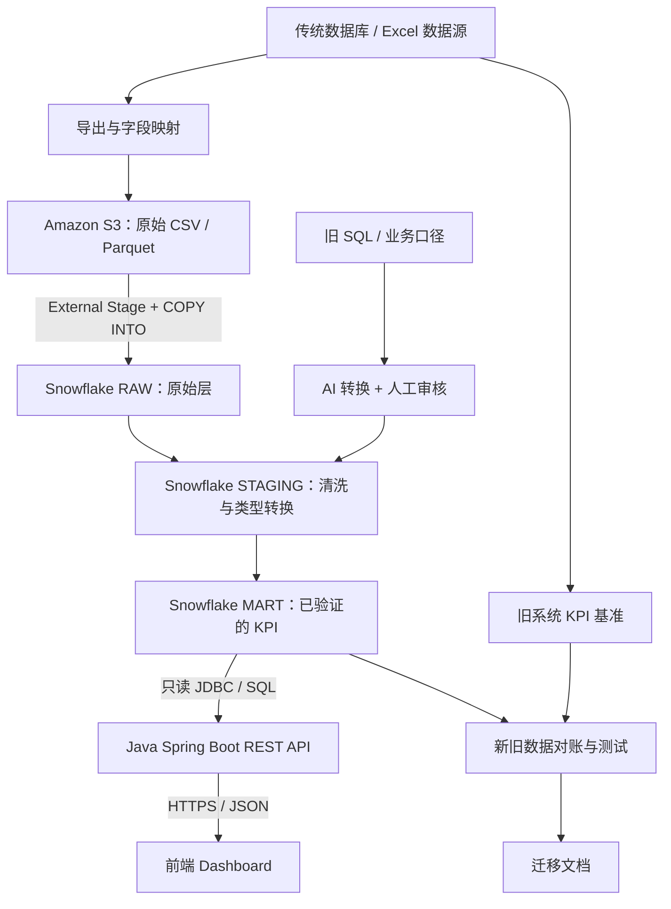

# Datathon｜AI 辅助传统系统迁移

[English](README.md) | [简体中文](README_CN.md)

> 用例 4 · 解决方案架构与团队实施计划  
> **当前状态：** 本文为拟议架构和开发计划，不代表已完成部署。  
> **目标平台：** AWS 上的 Snowflake。

## 1. 项目概述

将传统医疗用品销售报表迁移到云端分析平台。通过 AI 辅助梳理旧系统资产、映射字段、转换 SQL，以及编写测试和文档。新系统的业务结果必须与旧系统基准对账；只做出一个能够展示数字的 Dashboard 不足以证明迁移正确。

| 预期成果 | 交付证据 |
|---|---|
| 分析旧系统资产 | 源文件／表、旧 SQL、报表和 KPI 定义清单 |
| 设计目标架构 | 架构图、数据流、组件职责与权限边界 |
| 展示 AI 辅助迁移 | 原始 SQL、AI 转换结果、人工修改与审核记录 |
| 验证及测试 | 新旧行数、KPI 对账和数据质量检查 |
| 编写迁移文档 | 数据字典、新旧字段映射、操作手册和已知限制 |

**MVP：** 从一份约定的数据源生成“按地区统计的月度销售额”。在编写 SQL 之前，统一报表日期、币种、销售额、退货和地区的业务定义。仓库现有 Excel 工作簿只能先视为候选数据源，应检查工作表和字段，不能直接假定它们是旧数据库的导出结果。

## 2. 目标系统架构



| 组件 | 主要职责 | 边界与约束 |
|---|---|---|
| 旧数据库／Excel | 提供原始数据、报表、已有 SQL 和基准结果 | 保留原有业务口径以便对比 |
| Amazon S3 | 保存原始导出文件和导入清单 | S3 是对象存储，**不是** SQL 查询引擎 |
| AWS 上的 Snowflake | 导入、清洗、建模、查询与验证 | 使用 **RAW → STAGING → MART**；大批量 ETL 在 SQL 层完成 |
| Spring Boot | 校验请求、控制权限，以 REST API 返回查询结果 | 只读访问 MART；不在每次 API 请求时用 Java 批量处理 S3 文件 |
| Dashboard | 展示销售 KPI 和迁移验证情况 | 通过 API 取数，不在浏览器暴露数据库凭证 |

**首次导入：** 从旧系统导出 CSV／Parquet → 上传 S3 → 配置最小权限的 Snowflake Storage Integration 和 External Stage → 通过 `COPY INTO` 导入 RAW。优先实现可重复的手动批处理；Snowpipe、Streams/Tasks 和 dbt 可以后续再加。

### 建议的仓库结构

以下目录为**计划中的结构**，并非已经创建的文件。现有 Excel 文件应作为候选原始数据保留。

```text
datathon/
├── README.md
├── README_CN.md
├── 2026-*.xlsx               # 当前已有的候选数据文件
├── docs/
│   ├── architecture.md       # 架构说明
│   ├── data-dictionary.md    # 数据字典
│   ├── source-to-target.md   # 新旧字段映射
│   ├── ai-conversion-log.md  # AI 转换与人工审核记录
│   └── validation-report.md  # 数据对账报告
├── sql/{legacy,raw,staging,mart,tests}/
├── backend/                  # Spring Boot
├── frontend/                 # Dashboard
└── infra/                    # 基础设施定义，不存储密钥
```

## 3. API 与 Dashboard 接口约定

建议先实现：`GET /api/v1/sales/monthly?month=YYYY-MM&region=REGION`。Spring Boot 使用参数化 SQL 查询已批准的 MART 表／视图，再以 JSON 返回月份、地区、币种、月销售额和数据刷新时间。前后端分工开发前，需统一精确的响应 Schema 和 KPI 口径；后端应进行参数校验、设置查询超时，并配置必要的权限控制。

最小 Dashboard 包含月度销售 KPI、月份／地区筛选、一张趋势图或地区对比图，以及迁移验证状态或验证报告链接。在迁移正确性得到证明前，不应把大量时间投入复杂 UI。

## 4. 团队分工与实施阶段

下面的六种**角色表示职责，不代表必须有六个人**。根据实际团队人数确定负责人。

### 第一阶段 — Basic：端到端 MVP

| 角色 | 主要任务 | 交付物 |
|---|---|---|
| **Solution Architect／解决方案架构师** | 定义范围、目标架构、KPI 口径、API 契约、依赖关系和验收标准。 | 架构图 v1、范围和接口约定 |
| **Cloud Engineer／云工程师** | 配置 S3、最小权限 IAM、Snowflake DEV、Storage Integration 和 External Stage。 | 可用的开发环境 |
| **Data Engineer／数据工程师** | 检查数据源，导出 CSV／Parquet，上传 S3，使用 `COPY INTO` 导入一张 RAW 表。 | 可重复的首次导入及行数日志 |
| **Analytics Engineer／分析工程师** | 梳理旧 SQL，用 AI 转换一段典型查询，人工审核并实现 STAGING／MART。 | 原始和转换 SQL、审核记录、首个模型 |
| **Data Analyst／数据分析师** | 定义销售额、退货、统计期间和地区，计算旧系统基准并设计看板草图。 | KPI 字典、基准数值和界面草图 |
| **Data Scientist／数据科学家** | 检查缺失值、重复键、非法日期／金额，比较新旧系统初步结果。 | 数据质量报告和首次对账 |

**第一阶段验收：** 一份数据能够重复导入 RAW；至少一段 AI 转换 SQL 经人工审核；新旧行数和约定 KPI 一致或差异有明确解释；API 和 Dashboard 展示经过验证的结果。

### 第二阶段 — Standard：可靠且可审计的迁移

| 角色 | 主要任务 | 交付物 |
|---|---|---|
| **Solution Architect／解决方案架构师** | 完善 RAW／STAGING／MART、权限、接口、审核关卡和风险清单。 | 架构图 v2 与风险清单 |
| **Cloud Engineer／云工程师** | 条件允许时区分 DEV／PROD，增加成本控制、可重复环境配置及可选定时导入。 | 可管理的云环境 |
| **Data Engineer／数据工程师** | 实现幂等导入、批次日志、Schema 变更处理和可选增量导入。 | 可重复执行的数据管道 |
| **Analytics Engineer／分析工程师** | 扩展有测试的 SQL 模型，AI 转换更多旧 SQL，记录提示词、生成结果、人工修改和测试；可选 dbt。 | SQL 模型、测试与 AI 转换记录 |
| **Data Analyst／数据分析师** | 对比新旧报表的筛选、聚合和 KPI 口径，完善 Dashboard。 | 新旧报表对比报告 |
| **Data Scientist／数据科学家** | 按月份 × 地区 × 产品类别对账，解释差异并统计 AI SQL 首次正确率。 | 详细对账与 AI 效果评估 |

**第二阶段验收：** 重复运行不产生重复数据，关键测试通过，总体和分组 KPI 对账完成，新旧字段映射与 AI 审核决定可追溯。

### 第三阶段 — Advanced：可选增强

| 角色 | 主要任务 | 交付物 |
|---|---|---|
| **Solution Architect／解决方案架构师** | 编写可复用迁移手册、回滚方案和工作量估算。 | 迁移手册与风险／工时总结 |
| **Cloud Engineer／云工程师** | 按需加入 Terraform、CI/CD、监控和成本告警。 | 可复现的基础设施 |
| **Data Engineer／数据工程师** | 试做受控 AI 助手：建议 SQL、执行经过批准的 DEV 测试并标记差异。 | 需人工批准的迁移原型 |
| **Analytics Engineer／分析工程师** | 使用 AI 起草测试和文档，展示数据血缘。 | 文档与血缘展示 |
| **Data Analyst／数据分析师** | 为看板添加迁移就绪检查和待解决差异。 | 迁移质量看板 |
| **Data Scientist／数据科学家** | 数据支持时展示需求预测或临期库存预警。 | 可选 ML 演示 |

**优先级：** 首先完成第一阶段，其次优先做第二阶段的 AI 转换记录与数据对账。第三阶段不是 MVP 的前置条件。

## 5. AI 辅助 SQL 转换流程

1. **保存原始资产：** 留存旧 SQL、Schema、样例输入、基准输出和业务定义。
2. **AI 生成：** 生成兼容 Snowflake 的 SQL 和明确的新旧字段映射建议。
3. **人工审核：** 检查关联键、类型、空值、日期、币种、退货和聚合粒度。
4. **DEV 测试：** 在受控数据上执行已批准 SQL，不给予 AI Agent 生产环境写入权限。
5. **结果对账：** 与旧系统基准比较，调查不一致的地方。
6. **记录审批：** 保存提示词／模型版本、生成 SQL、人工修改、测试、审核人和批准结果。

**SQL 能正常执行不等于业务迁移正确。** 必须同时验证语法和计算结果。

## 6. 数据验证与验收

| 检查项 | 方法 | 验收标准 |
|---|---|---|
| 行数 | 比较源文件、RAW 和有记录的各阶段过滤结果。 | 无主动过滤时严格一致，否则解释每个差异。 |
| 销售额与退货 | 按相同业务定义和币种精度比较新旧月度 KPI。 | 无无法解释的金额差异。 |
| 分组对账 | 按月份 × 地区，并在可用时按品类比较。 | 无未解释的分组差异；仅总额一致不足以证明正确。 |
| 数据质量 | 测试必填字段、唯一键、有效类型／日期／金额和引用完整性。 | 约定的关键测试通过，异常被记录。 |
| API 一致性 | 使用相同筛选条件比较 API 与已批准 MART 查询。 | 两者数值一致。 |

保留源数据快照、字段映射、SQL 版本及测试证据。不能为了强行让 KPI 一致而悄悄删除异常记录。

## 7. 安全、治理与成本

- AWS IAM 和 Snowflake 遵循最小权限原则；Spring Boot API 只读已批准的 MART 数据。
- 不向 GitHub 提交 AWS 凭证、Snowflake 密钥、私钥、密码、`.env` 文件或真实患者／客户数据。
- 演示优先使用合成或脱敏数据。使用真实个人或健康信息前，先确认比赛规则及适用隐私义务。
- 设置 AWS 成本告警，合理配置 Snowflake Warehouse 并开启自动暂停，避免不必要的常驻服务。
- 除非主办方要求全部上云，否则 MVP 可以在本地运行 Java 后端与前端。

## 8. 实施顺序与当前状态

| 步骤 | 团队行动 | 完成证据 |
|---|---|---|
| 1 | 检查源工作表、字段、旧 SQL 和 KPI 口径。 | 数据字典与旧系统基准 |
| 2 | 确认负责人、架构和 API 响应 Schema。 | 架构图与接口契约 |
| 3 | 将一份数据上传 S3 并导入 Snowflake RAW。 | 导入日志与行数检查 |
| 4 | AI 转换并审核一段旧 SQL，建立 STAGING／MART。 | SQL 与 AI 转换记录 |
| 5 | 按月份和地区对账销售额。 | 验证报告 |
| 6 | 用 Spring Boot 只读接口连接最小 Dashboard。 | 端到端可运行演示 |
| 7 | 整理证据、已知限制与迁移手册。 | 可复现的交付包 |

**当前实施状态：** 仓库中已有候选 Excel 文件和规划文档。以下任务尚未核实为已完成：


- [ ] 从 S3 导入一份数据到 Snowflake RAW。
- [ ] 审核一段 AI 转换的 SQL 及字段映射。
- [ ] 完成新旧 KPI 对账。
- [ ] 实现并演示 Spring Boot API 与 Dashboard。
- [ ] 发布迁移验证证据与文档。


